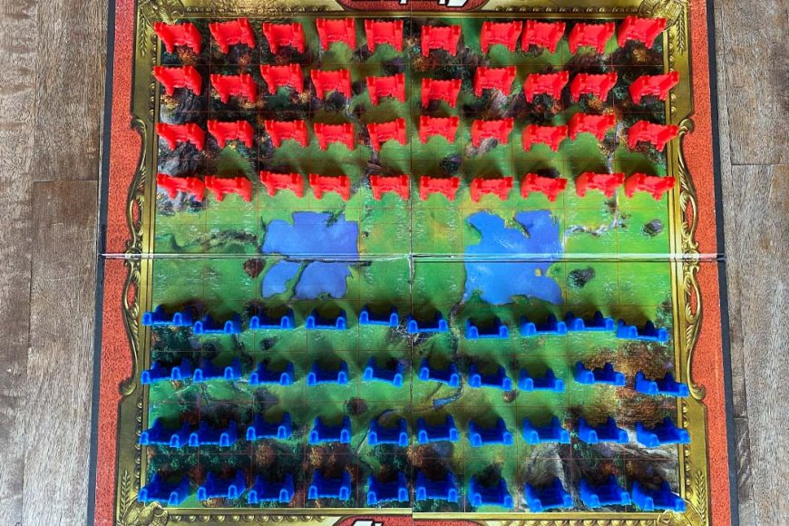

# OOP-final-project

Final project for object oriented programming w/ Dr. Ram Basnet.

## Authors

Nate Barnaik
Jordan Dehmel
Kate Eckhart

# Abstract

# Outline

## Pieces Per Player

Rank | Name    | Count | Properties
-----|---------|-------|----------------------------------------
10   | Marshal | 1     | Killed by spies
9    |         | 1     |
8    |         | 2     |
7    |         | 3     |
6    |         | 4     |
5    |         | 4     |
4    |         | 4     |
3    | Miner   | 5     | Can defuse bombs
2    | Scout   | 8     | Moves any number of spaces
1    | Spy     | 1     | Kills marshals
F    | Flag    | 1     | Win condition
B    | Bomb    | 6     | Kills all non-miners

## Board

## Rules

- You can only see your own pieces.
- Pieces are set up at the beginning.
- Each player begins with the pieces specified above.
- Pieces are set up in any orientation of 4x10.
- Bombs and flags cannot move.
- Most pieces can move (non-diagonally) one space per turn.
- Pieces cannot move into lake spaces.
- If a piece advances into a piece of the opposite color, it is
    a challenge. Whichever piece is of lower rank will be
    removed from play, unless a special case occurs. If the
    piece which was moved into is a flag, the moving piece's
    side wins. If it was a bomb, both pieces are removed unless
    a special case occurs.
- If a "miner" (rank 3) challenges a bomb, the bomb is
    "diffused" and removed from play.
- If a spy and a marshal are involved in a challenge, the
    marshal is removed from play.
- Red plays first.
- Scouts can move any number of spaces horizontally or
    vertically in a single turn, optionally challenging a piece
    in the same turn.
