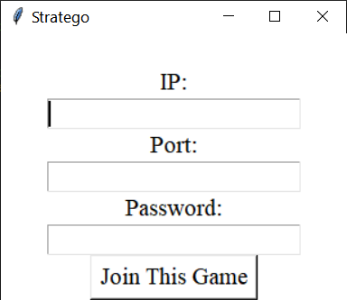

# OOP-final-project

Final project for object oriented programming w/ Dr. Ram Basnet.

## Authors

Nate Barnaik \
Jordan Dehmel \
Kate Eckhart (no longer on team)

## Judge Scores from Showcase

Category            | Judge 1 | Judge 2 | Average
--------------------|---------|---------|----------
OOD                 | 5/5     | 5/5     | 5/5
Design patterns     | 5/5     | 4/5     | 4.5/5
Testing             | 5/5     | 5/5     | 5/5
Documentation       | 5/5     | 4/5     | 4.5/5
Software management | 5/5     | 5/5     | 5/5
Teamwork            | 3/5     | 5/5     | 4/5
Execution           | 5/5     | 5/5     | 5/5
Presentation        | 4/5     | 5/5     | 4.5/55
4+1 vies            | 5/5     | 5/5     | 5/5
Above and beyond    | 10/10   | 2/10    | 6/10
Total               | 42?/45  | 45/45   | 43.5/45

### Judge 1 (Johnson)

### Judge 2 (Bergen)

## Self-Grading

### Self-Grading According to Jordan Dehmel

Category            | Self-Grade | Notes
--------------------|------------|------------------------------
OOD                 | 5/5        |
Design patterns     | 5/5        |
Testing             | 5/5        |
Documentation       | 5/5        |
Software management | 3/5        | Could rely more on software
Teamwork            | 3/5        | Communication could improve
Execution           | 5/5        |
Presentation        | 4/5        | More rehearsal
4+1 vies            | 5/5        |
Above and beyond    | 5/10       | Good GUI unit testing, networking
Total               | 45/45      |

**Final self-grade: 40/40**

**Justification:** All aspects of the project were thoroughly
completed on-time. All requirements were met. The only aspects
of this project which need improvement are "soft skills":
Communication and group participation was mediocre.
Additionally, more communication could have been done via
software management tools throughout development. That all being
said, I am very proud of the documentation and testing: I spent
a copious amount of time getting the GUI to 100% coverage, and
had to use the concepts mentioned in class (IE patching,
mocking) thoroughly throughout. The documentation is also very
thorough and consistant.

### Self-Grading According to Nate Barnaik

Category            | Self-Grade | Notes
--------------------|------------|------------------------------
OOD                 | 5/5        |
Design patterns     | 5/5        |
Testing             | 5/5        |
Documentation       | 5/5        |
Software management | 3/5        | Better use of management tools
Teamwork            | 2/5        | Communcation was poor and the distribution of work was skewed to one member
Execution           | 5/5        |
Presentation        | 4/5        | More time to rehearse
4+1 vies            | 5/5        |
Above and beyond    | 4/10       | 100% testing coverage and networking
Total               | 43/45      |

**Final self-grade: 38/40**

**Justification:** Everything required of the project was
completed on time, however the work between members to complete
the project was skewed to one member in particular.  Part of this
was due to poor communcation between members during the start of
the project.  This did improved as time went on, but the effects
are still there.  While we did plan to better use software
management tools, the one we looked at wouldn't work for me
and we ended up just using GitHub.  Getting to 100% testing
coverage took a lot of work and was very pleasing to do.
All in all, bad communcation at the start of the project caused
early problems that we where able to fix by the end.

## Dependencies:
- `python3`
- `python-tk`
- `python-hypothesis`
- `python-unittest`

## How to Test
- Launch Docker (optional if on Linux): `bash run.sh`
- Run tests, style and type checker: `make all`
- Run style checker: `make check-style`
- Run type checker: `make check-type`
- Run tests: `make run-test`
- Run coverage tests: `make run-cov`

## How to Run
- Ensure dependencies are satisfied
- Ensure `tkinter` works with your OS (Linux and MacOS are fine)
- Run from **outside** of Docker: `python3 main.py`

### How to Host
- On the main menu click on Host Game.

- From there you'll see a menu to input an IP and a Port, fill
    each box out with the desired IP and Port the press Host
    This Game.
- Note: Pressing "Host This Game" without providing an IP or Port
    will use 127.0.0.1 for the IP and 12345 for the Port by default.

- After doing the step above you'll be put to a waiting menu
    with the selected IP, Port and a random 4 character password.
- Give the password to the person you wish to play with and wait.

### How to Join
- On the main menu click on Join Game.

- From there you'll see a menu to input an IP, Port and Password,
    fill out each box with the IP and Port decided by the host user
    and fill out the Password givin from the host user.
- Once all the boxes are filled click on Join This Game.
- Note: Like with hosting IP and Port will default to 127.0.0.1 and
    12345 respectfully if kept blank and you join a game, however
    a password will still be needed to join.

- You should now see your board and be able to start playing!

# Abstract

Stratego is a board game in which two players command an
army to try and capture the opposing player's flag or defeat
every moveable piece.  Each player’s army has 40 pieces that
they place on their side of the board as they please, with each
piece having a different rank and some pieces having special
abilities like full movement in one direction.  When a piece
attacks another piece, the piece with the lower rank is removed
from the board, if the ranks are the same then both pieces are
removed from the board.  Exceptions are the Spy which can remove
the Marshal, Bombs which can remove anything that attacks them,
except Miners who are the only piece that can remove bombs. All
of these rules can be done by setting up a base piece class
which has child classes for each piece type.  PyGame can be of
help when displaying the game to the player, and object-based
Python networking can be used for multiplayer. This project
outlines the construction of an Object-Oriented Python
implementation of Stratego.

# Outline

## Pieces Per Player

Rank | Name       | Count | Properties
-----|------------|-------|-------------------------------------
10   | Marshal    | 1     | Killed by spies
9    | General    | 1     |
8    | Colonel    | 2     |
7    | Major      | 3     |
6    | Captain    | 4     |
5    | Lieutenant | 4     |
4    | Sergeant   | 4     |
3    | Miner      | 5     | Can defuse bombs
2    | Scout      | 8     | Moves any number of spaces
1    | Spy        | 1     | Kills marshals
F    | Flag       | 1     | Win condition
B    | Bomb       | 6     | Kills all non-miners

## Board

## Rules

- You can only see your own pieces.
- Pieces are set up at the beginning.
- Each player begins with the pieces specified above.
- Pieces are set up in any orientation of 4x10.
- Bombs and flags cannot move.
- Most pieces can move (non-diagonally) one space per turn.
- Pieces cannot move into lake spaces.
- If a piece advances into a piece of the opposite color, it is
    a challenge. Whichever piece is of lower rank will be
    removed from play, unless a special case occurs. If the
    piece which was moved into is a flag, the moving piece's
    side wins. If it was a bomb, both pieces are removed unless
    a special case occurs.
- If a "miner" (rank 3) challenges a bomb, the bomb is
    "diffused" and removed from play.
- If a spy and a marshal are involved in a challenge, the
    marshal is removed from play.
- Red plays first.
- Scouts can move any number of spaces horizontally or
    vertically in a single turn, optionally challenging a piece
    in the same turn.

## Project 4+1 Diagrams

Development: \

Logical: \

Physical: \

Process: \

Scenarios: \

## Final Class Interaction UML Diagram

This diagram shows the APIs as they existed at the conclusion of
the project.

## Attribution
Please enter what you have done below.

Nate Barnaik:
 - Abstract
 - 1 UML diagram
 - Network debugging
 - Network testing

Jordan Dehmel:
 - Basic framework for GUI, Networking, and Pieces
 - 2 UML diagrams (development and physical)
 - KanBan board management
 - Github issues
 - GUI artwork and design
 - GUI unit testing to 100% coverage
 - Piece testing to 100% coverage
 - Board testing to 100% coverage
 - Final class UML diagram
 - API documentation, discussion of design patterns

Kate Eckhart (no longer on team):
 - 2 UML diagrams
 - Initial network unit testing
 - Github issues
