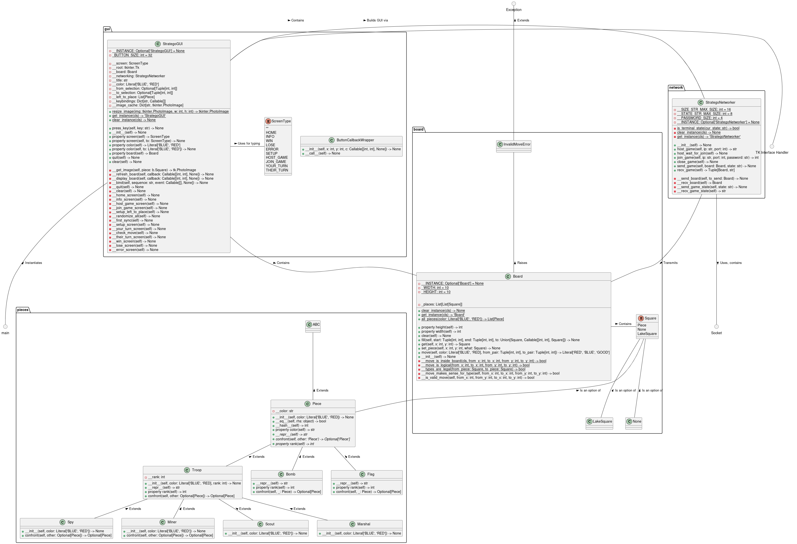

# OOP-final-project

Final project for object oriented programming w/ Dr. Ram Basnet.

## Authors

Nate Barnaik \
Jordan Dehmel \
Kate Eckhart (no longer on team)

## Judge Scores from Showcase

Category            | Judge 1 | Judge 2 | Average
--------------------|---------|---------|----------
OOD                 | 5/5     | 5/5     | 5/5
Design patterns     | 5/5     | 4/5     | 4.5/5
Testing             | 5/5     | 5/5     | 5/5
Documentation       | 5/5     | 4/5     | 4.5/5
Software management | 5/5     | 5/5     | 5/5
Teamwork            | 3/5     | 5/5     | 4/5
Execution           | 5/5     | 5/5     | 5/5
Presentation        | 4/5     | 5/5     | 4.5/55
4+1 vies            | 5/5     | 5/5     | 5/5
Above and beyond    | 10/10   | 2/10    | 6/10
Total               | 42?/45  | 45/45   | 43.5/45

## How to Run

Dependencies:
- `python3`
- `python-tk`
- `python-hypothesis`
- `python-unittest`

To launch Docker for testing purposes: `bash run.sh`

To run all tests from within Docker: `make`

To run game from **outside** of Docker: `python3 main.py`

# Abstract

Stratego is a board game in which two players command an
army to try and capture the opposing player's flag or defeat
every moveable piece.  Each player’s army has 40 pieces that
they place on their side of the board as they please, with each
piece having a different rank and some pieces having special
abilities like full movement in one direction.  When a piece
attacks another piece, the piece with the lower rank is removed
from the board, if the ranks are the same then both pieces are
removed from the board.  Exceptions are the Spy which can remove
the Marshal, Bombs which can remove anything that attacks them,
except Miners who are the only piece that can remove bombs. All
of these rules can be done by setting up a base piece class
which has child classes for each piece type.  PyGame can be of
help when displaying the game to the player, and object-based
Python networking can be used for multiplayer. This project
outlines the construction of an Object-Oriented Python
implementation of Stratego.

# Outline

## Pieces Per Player

Rank | Name       | Count | Properties
-----|------------|-------|-------------------------------------
10   | Marshal    | 1     | Killed by spies
9    | General    | 1     |
8    | Colonel    | 2     |
7    | Major      | 3     |
6    | Captain    | 4     |
5    | Lieutenant | 4     |
4    | Sergeant   | 4     |
3    | Miner      | 5     | Can defuse bombs
2    | Scout      | 8     | Moves any number of spaces
1    | Spy        | 1     | Kills marshals
F    | Flag       | 1     | Win condition
B    | Bomb       | 6     | Kills all non-miners

## Board

## Rules

- You can only see your own pieces.
- Pieces are set up at the beginning.
- Each player begins with the pieces specified above.
- Pieces are set up in any orientation of 4x10.
- Bombs and flags cannot move.
- Most pieces can move (non-diagonally) one space per turn.
- Pieces cannot move into lake spaces.
- If a piece advances into a piece of the opposite color, it is
    a challenge. Whichever piece is of lower rank will be
    removed from play, unless a special case occurs. If the
    piece which was moved into is a flag, the moving piece's
    side wins. If it was a bomb, both pieces are removed unless
    a special case occurs.
- If a "miner" (rank 3) challenges a bomb, the bomb is
    "diffused" and removed from play.
- If a spy and a marshal are involved in a challenge, the
    marshal is removed from play.
- Red plays first.
- Scouts can move any number of spaces horizontally or
    vertically in a single turn, optionally challenging a piece
    in the same turn.

## Project 4+1 Diagrams

Development: \

Logical: \

Physical: \

Process: \

Scenarios: \

## Final Class Interaction UML Diagram

This diagram shows the APIs as they existed at the conclusion of
the project.

## Attribution
Please enter what you have done below.

Nate Barnaik:
 - Abstract
 - 1 UML diagram
 - Network debugging
 - Network testing

Jordan Dehmel:
 - Basic framework for GUI, Networking, and Pieces
 - 2 UML diagrams (development and physical)
 - KanBan board management
 - Github issues
 - GUI artwork and design
 - GUI unit testing to 100% coverage
 - Piece testing to 100% coverage
 - Board testing to 100% coverage
 - Final class UML diagram
 - API documentation, discussion of design patterns

Kate Eckhart (no longer on team):
 - 2 UML diagrams
 - Initial network unit testing
 - Github issues
